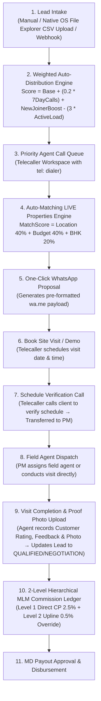
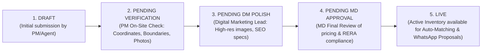

# Radha Real Homes & Sonthillu EMS/CRM — Complete System Documentation & Technical Guide

---

## 1. Executive Summary & Architecture Overview

The **Radha Real Homes & Sonthillu Employee Management System (EMS) & CRM** is an enterprise-grade Progressive Web App (PWA) engineered for real estate companies managing multi-brand commercial, plot, and luxury residential projects.

### Core Tech Stack:
- **Frontend**: React, TypeScript, Vite, Vanilla CSS + Tailwind, Lucide React Icons, PWA Service Worker.
- **Backend API**: Node.js, Express, TypeScript, Prisma ORM, Helmet security, JWT authentication.
- **Database**: Hostinger Cloud MySQL Database (`82.25.121.145:3306` - Single Source of Truth).
- **Architecture**: Monorepo Structure (`apps/api`, `apps/web`, `packages/shared`, `prisma`).

---

## 2. Role-Based Access Control (RBAC) & Page Control Matrix

The system enforces strict multi-tenant Role-Based Access Control. Below is the complete matrix detailing which role controls which pages, features, and permissions:

| Module / Page | Controlled By Roles | Description & Scope |
|---|---|---|
| **MD Command Center** | `MD`, `Admin (Technical)` | Real-time executive oversight: Closed deal revenue, monthly run-rate, total active portfolio, property pipeline stats, attendance exception counts, performance score leaderboard. |
| **Telecaller Daily Workspace** | `Telecaller / Sales Agent` | Assigned lead call queue, `tel:` direct dialer, daily call target gauge (e.g. 18/25 calls), voice dictation work logger. |
| **PM Inspection Workstation** | `Project Manager`, `MD` | Stage 1 Property Verification queue (`PENDING_VERIFICATION`), site inspection checklist, location map view. |
| **Leads & Distribution** | `Telecaller`, `Sales Manager`, `Digital Lead Operator`, `MD` | Lead intake (Manual & Native OS File Picker CSV Upload), Weighted Auto-Distribution Engine, Lead Dossier, Auto-Matching LIVE Properties, WhatsApp Proposal Generator, Book Site Visit. |
| **Properties & Inventory** | `Project Manager`, `Digital Marketing Lead`, `MD` | Housing.com-style property pipeline. 4-Stage Verification Workflow (`DRAFT` $\rightarrow$ `PENDING_VERIFICATION` $\rightarrow$ `PENDING_DM_POLISH` $\rightarrow$ `PENDING_MD_APPROVAL` $\rightarrow$ `LIVE`). |
| **Channel Partners** | `MD`, `Sales Manager`, `CP Lead` | Channel Partner Directory (Silver 2.0%, Gold 2.5%, Platinum 3.0%), Upline Parent CP link, 60-Day Anti-Poaching Protection Lock, 2-Level MLM Commission Ledger, MD Payout Approval. |
| **Site Visits & Field Dispatch** | `Telecaller`, `Project Manager`, `Field Agent`, `MD` | Real-World Visit Pipeline: Booking $\rightarrow$ Telecaller Schedule Verification Call $\rightarrow$ PM Agent Dispatch $\rightarrow$ Field Visit Completion, Customer Feedback & On-Site Proof Photo Upload. |
| **Task Manager** | All Active Employees | Daily task tracking, voice dictation work logger with transcript parsing. |
| **Performance Index** | All Employees, `MD` | Real-time score (Base 50 + Task Events + Daily Report Boost + 7-Day Calls - Penalties), score history timeline audit trail. |
| **Team & Employees** | `MD`, `HR Manager`, `Admin (Technical)` | Employee directory, role assignments, attendance requirement toggles (`attendance_required: true/false`). |
| **Target Configurator** | `MD`, `Marketing Director`, `Admin (Technical)` | Setting daily/monthly call & closed revenue targets per employee. |
| **Proposals & Leaves** | Non-Management Employees (`Telecaller`, `Agent`, `PM`) | Employee late arrival & leave application proposals (Hidden for MD/Management). |
| **MD Control Dashboard** | `MD`, `Admin (Technical)` | Executive controls: Attendance exemption toggles, score audit overrides, security logs. |

---

## 3. End-to-End Real-World Workflows

### A. Lead-to-Closure & Site Visit Workflow

### B. 4-Stage Property Listing & Verification Pipeline

---

## 4. Key Systems & Concepts Explained

### 1. Weighted Lead Auto-Distribution Engine (`distributionEngine.ts`)
Calculates real-time distribution weight for eligible active telecallers:
$$\text{Weight} = \text{Base Score} + (0.2 \times \text{7-Day Calls}) + \text{New Joiner Quota Boost} - (3 \times \text{Active Load})$$
The lead is automatically assigned to the telecaller with the highest score, ensuring top performers and new joiners receive priority lead flow.

### 2. 2-Level Hierarchical MLM Commission Engine (`cp.ts`)
- **Direct CP (Level 1)**: Receives full tier rate on closed deals:
  - **Silver Tier**: 2.0% base rate
  - **Gold Tier**: 2.5% rate
  - **Platinum Tier**: 3.0% top rate
- **Upline Parent CP (Level 2 Override)**: Parent agency receives a **0.5% override cut** on all closed deals generated by downline CPs.
- Payout entries enter `CPPayout` ledger in `PENDING_MD_APPROVAL` state, requiring MD approval for disbursement.

### 3. 60-Day Anti-Poaching Protection Lock (`LeadProtectionLock`)
Prevents internal poaching of Channel Partner registered clients. Protects the lead for 60 days, blocking re-assignment to telecallers during the active protection window.

### 4. Attendance & Logout Exemption Policy
- Employees with `attendanceRequired === false` or management roles (`MD`, `Admin`, `HR Manager`, `Marketing Director`):
  - Can **freely log out without any daily report modal prompt**.
  - Do not trigger attendance exception alerts.

---

## 5. Development Summary & Fixes Log

Below is a record of all operational fixes and architectural enhancements implemented:

1. **Hostinger MySQL Connection Resilience**: Standardized `.env` and `schema.prisma` to Hostinger MySQL (`82.25.121.145:3306`) as single source of truth across all environments.
2. **Session Compatibility**: Added fallbacks (`req.user?.companyId || (req.user as any)?.company_id || 1`) to ensure JWT session tokens never break on schema updates.
3. **Native OS File Manager Upload**: Connected CSV Bulk Upload button to native HTML5 file input ref (`fileInputRef.current?.click()`), launching the OS File Explorer.
4. **Dynamic Executive Metrics**: Replaced all hardcoded dashboard values with real dynamic DB aggregates (`GET /api/v1/md/executive-metrics`).
5. **Real-World Site Visit Pipeline**: Built `SiteVisitBooking` model, schedule verification calls, PM agent dispatch, and proof photo upload.
6. **Vite & Prisma Cleanups**: Removed duplicate variable declarations and added missing `Company` back-relations (`leads`, `properties`, `channel_partners`).
7. **All-Device Responsiveness**: Applied `min-h-[48px]` touch targets for mobile bottom nav, `no-scrollbar` horizontal header scrolling, and responsive modal containment (`max-h-[90vh] overflow-y-auto`).

---

## 6. Summary of Key File Locations

- **Main App Layout & Navigation**: [apps/web/src/App.tsx](file:///d:/HYD/RRH%20PWA/apps/web/src/App.tsx)
- **Database Schema**: [prisma/schema.prisma](file:///d:/HYD/RRH%20PWA/prisma/schema.prisma)
- **API Server Entry**: [apps/api/src/server.ts](file:///d:/HYD/RRH%20PWA/apps/api/src/server.ts)
- **MD Executive Dashboard**: [MDExecutiveDashboard.tsx](file:///d:/HYD/RRH%20PWA/apps/web/src/components/dashboards/MDExecutiveDashboard.tsx)
- **Telecaller Workspace**: [TelecallerDashboard.tsx](file:///d:/HYD/RRH%20PWA/apps/web/src/components/dashboards/TelecallerDashboard.tsx)
- **PM Inspection Workstation**: [PMDashboard.tsx](file:///d:/HYD/RRH%20PWA/apps/web/src/components/dashboards/PMDashboard.tsx)
- **Leads & Auto-Distribution**: [LeadManagement.tsx](file:///d:/HYD/RRH%20PWA/apps/web/src/components/leads/LeadManagement.tsx)
- **Property Verification Pipeline**: [PropertyManagement.tsx](file:///d:/HYD/RRH%20PWA/apps/web/src/components/properties/PropertyManagement.tsx)
- **Channel Partner MLM Suite**: [ChannelPartnerManagement.tsx](file:///d:/HYD/RRH%20PWA/apps/web/src/components/cp/ChannelPartnerManagement.tsx)
- **Site Visit & Field Dispatch**: [SiteVisitManagement.tsx](file:///d:/HYD/RRH%20PWA/apps/web/src/components/siteVisits/SiteVisitManagement.tsx)
- **Mobile Bottom Navigation**: [MobileBottomNav.tsx](file:///d:/HYD/RRH%20PWA/apps/web/src/components/common/MobileBottomNav.tsx)
