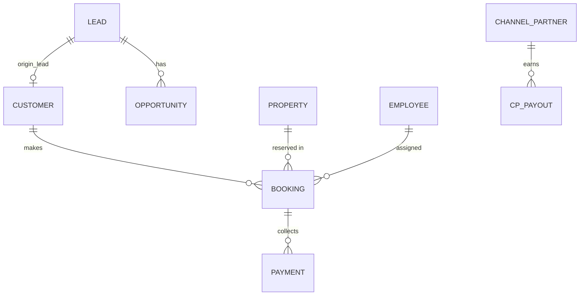

# Phase 9 Readiness Reconciliation - Booking & Transaction Domain

## 1. Executive Summary
Phase 9 represents the transition from the commercial sales process (Phase 8 Opportunity) to the formal transaction and financial lifecycle. An architectural audit of the current repository has discovered that foundational `Booking` and `Payment` models were previously scaffolded in Phase 5 but lack robust integration with the newly approved Phase 8 Opportunity layer. Furthermore, critical concurrency safeguards surrounding inventory reservation are missing, leaving the system vulnerable to race conditions where multiple sales executives could theoretically double-book a single property unit.

This document analyzes the existing Phase 5/Legacy booking implementation, identifies architectural gaps, and proposes a complete Phase 9 architecture that enforces real-estate transaction invariants, ensures financial integrity, and provides a clear boundary between sales, transaction, and property delivery.

## 2. Current Booking Architecture
**Status:** Scaffolded but disconnected from Phase 8.
- **Models Inspected:** `Booking`
- **Fields:** `booking_code`, `company_id`, `branch_id`, `customer_id`, `property_id`, `assigned_employee_id`, `status` (PENDING, CONFIRMED, CANCELLED, COMPLETED), `agreed_price`, `booking_amount`, `balance_amount`, `booking_date`.
- **Relations:** Belongs to `Company`, `Branch`, `Customer`, `Property`, `Employee` (Assigned). Contains many `Payment`s.
- **Analysis:** 
  - The model does NOT link to `Lead` or `Opportunity`.
  - It relies entirely on `customer_id`, meaning a Lead must be converted to a Customer *before* or *during* Booking creation.
  - Financial fields (`agreed_price`, `booking_amount`, `balance_amount`) exist but currently lack strict immutability rules post-confirmation.
  - Cancellation does not explicitly track refunds or cancellation charges natively on the Booking model.
- **Services Inspected:** `booking.service.ts`.
- **Routes Inspected:** `/api/v1/bookings` (Inferred from service scope).
- **Policies:** `BookingPolicy` enforces multi-tenant company isolation and assigned-employee visibility rules.

## 3. Current Inventory Architecture
**Status:** Centralized but lacks transaction locking.
- **Models Inspected:** `Project`, `Property`.
- **Property Model Fields:** `brand_type`, `category` (VILLA, APARTMENT, PLOT, etc.), `price`, `area_sqft`, `location`, `status` (PENDING_VERIFICATION, LIVE, REJECTED, BOOKED, SOLD).
- **Analysis:**
  - Inventory is managed at the `Property` model level.
  - It lacks structural locking (e.g., `locked_until`, `reserved_by_booking_id`).
  - There is no concept of a "Temporary Hold" (e.g., locking a property for 24 hours while a client makes a token payment).

## 4. Current Payment Architecture
**Status:** Foundational ledger exists.
- **Models Inspected:** `Payment`.
- **Fields:** `amount`, `payment_method`, `reference_number`, `status` (PENDING, SUCCESS, FAILED, REFUNDED).
- **Analysis:**
  - Payments belong to a `Booking` and are recorded by an `Employee`.
  - The `PaymentService` reduces `booking.balance_amount` when a payment is marked as `SUCCESS`.
  - There is no formal Payment Schedule / Installment model. All balances are tracked holistically on the Booking level.

## 5. Current Customer Architecture
**Status:** Existing but independent.
- **Models Inspected:** `Customer`.
- **Fields:** `first_name`, `phone`, `email`, `status`, `origin_lead_id`.
- **Analysis:**
  - `Customer` can exist with an `origin_lead_id` indicating 1:1 migration.
  - Bookings are attached to Customers, not Leads.
  - The `CustomerService` enforces soft duplication checks via Phone Number within the company.

## 6. Current Document/KYC Architecture
**Status:** Missing for Customers.
- **Models Inspected:** `Customer`, `Booking`, `Property`.
- **Analysis:**
  - No Aadhaar, PAN, or KYC document array exists on the `Customer` or `Booking` tables.
  - (Note: `Employee` and `ChannelPartner` possess KYC fields, but end-buyers do not).
  - No Agreement/Receipt file linking structure exists on the Booking model.

## 7. Existing Legacy WON/Booking Logic
**Status:** Used only for internal metrics.
- **Analysis:**
  - The `WON` status on the `Lead` model is primarily a legacy string used in `LeadService` (`closureRate` calculations) for performance metrics. 
  - There is no automated trigger that creates a `Booking` or `Customer` when a Lead is marked `WON`. It appears to be an isolated dropdown status.

## 8. Opportunity → Booking Boundary Analysis
**Status:** Disconnected.
- **Analysis:**
  - Phase 8 `Opportunity` tracks sales pipelines up to `BOOKING_INITIATED` and `BOOKED`.
  - Phase 5 `Booking` requires `customer_id` and `property_id`.
  - The missing link: `Opportunity` does not possess a direct foreign key to `Booking`. When an Opportunity moves to `BOOKING_INITIATED`, a structured transaction must convert the `Lead` to a `Customer`, spawn a `Booking`, lock the `Property`, and upon booking success, echo the `BOOKED` state back to the `Opportunity`.

## 9. Channel Partner / Commission Analysis
**Status:** Foundational logic exists, but disconnected from Booking.
- **Models Inspected:** `ChannelPartner`, `CPPayout`, `LeadProtectionLock`.
- **Analysis:**
  - `CPPayout` (Commissions) are linked to `lead_id` and `property_id`, but NOT to `booking_id`. 
  - Phase 9 needs to reconcile how Commission connects to actual settled Bookings and collected Payments rather than abstract Leads.

## 10. Security & Multi-Tenant Analysis
**Status:** Solid foundation via Policies.
- **Analysis:**
  - `BookingPolicy` and `PaymentPolicy` successfully enforce `company_id` matching on all reads/writes.
  - Management roles bypass assignment restrictions, while Agents are restricted to `assigned_employee_id`.

---

## 11. Current Data Model Diagram



---

## Proposed Phase 9 Architecture

### 12. Proposed Domain Boundary
- **Opportunity:** Tracks the intent to purchase, expected value, negotiations. It hands off control at `BOOKING_INITIATED`.
- **Booking:** The absolute financial source of truth. Owns the transaction, legal status, and inventory claim.

### 13. Proposed Booking Lifecycle
1. **INITIATED**: Draft transaction.
2. **TOKEN_RECEIVED**: Initial monetary commitment secured.
3. **CONFIRMED**: Manager/Admin verification. KYC verified. All agreements signed.
4. **REGISTERED**: Legal handover complete.
5. **CANCELLED**: Transaction aborted (with optional penalty processing).

### 14. Proposed Inventory Lifecycle
1. **LIVE**: Available for any Opportunity.
2. **LOCKED**: Temporarily reserved (e.g., 24-48 hours) while a Booking is INITIATED.
3. **BOOKED**: Permanently claimed by a CONFIRMED Booking.
4. **SOLD**: Legal registration complete.

### 15. Proposed Payment Lifecycle
- Continue utilizing the `Payment` model.
- Add `PaymentPlan` or `Installment` capability if staged collections (e.g., 20% now, 80% on possession) are required.

### 16. Proposed Customer Relationship
- Transition to `Customer` must happen at Booking. A Booking requires a legal Customer entity, enforcing KYC requirements that are not mandatory for a Lead.

### 17. Proposed Financial Integrity Model
- `agreed_price`, `booking_amount`, `discounts`, and `taxes` must become **IMMUTABLE** upon transitioning to `CONFIRMED`. Any further adjustments must require a formal Amendment or Management Override audited by `ChangeEvent` logs.

### 18. Concurrency / Race Condition Analysis
**CRITICAL RISK DISCOVERED:** 
Currently, `BookingService.createBooking` queries `Property.status` via `findFirst` *outside* of the Prisma `$transaction` block. 
```typescript
const property = await p.property.findFirst({ ... }); // Outside TX
...
await p.$transaction(async (tx) => { ... tx.booking.create... tx.property.update... });
```
This is a fatal race condition. If two executives trigger `createBooking` for the same property at the same millisecond, both read `status === 'LIVE'`, and both successfully create overlapping Booking records and update the property status, leading to double-booking.

**Proposed Solution:**
- Move the property availability check *inside* the `$transaction`.
- Utilize pessimistic locking or Prisma's native unique constraints/transactional updates `tx.property.update({ where: { id: ID, status: 'LIVE' }, data: { status: 'LOCKED' }})` to guarantee atomic reservation.

### 19. Cancellation & Refund Architecture
- Introduce a formal `CancellationRequest` or state variables (`cancellation_reason`, `refund_amount`, `penalty_amount`) directly into the `Booking` schema.
- Upon cancellation, the system must atomically release the Property back to `LIVE`.

### 20. Audit Requirements
- Require an `AuditLog` for all financial mutations on a Booking post-creation.

---

## 21. API Architecture Recommendation
- Mount new endpoints specifically bridging Opportunity to Booking: `POST /api/v1/opportunities/:id/book`.
- Enforce strict validation that Property is LIVE before accepting the Booking payload.

## 22. Frontend Architecture Recommendation
- Build a dedicated `/bookings` workspace.
- Provide a "Convert to Booking" wizard within the Sales Opportunity Details panel that collects KYC, converts Lead -> Customer, locks the Property, and creates the Booking in one smooth UI flow.

## 23. Migration Strategy
- No destructive migrations.
- `schema.prisma` will be augmented with non-breaking additions (e.g., `booking_id` added to `Opportunity` as an optional foreign key).

## 24. Backward Compatibility Strategy
- Existing Phase 5 Bookings will naturally map to the new status lifecycle if defaults align.
- `Lead` status `WON` remains for reporting, but will now be systematically triggered when an Opportunity reaches `BOOKED`.

## 25. Risks
- **Concurrency:** The highest priority risk. Must be mitigated in Packet 1/2.
- **Orphaned Bookings:** If a token payment fails, the Property might remain LOCKED indefinitely. A chronological cron/reaper or strict expiry mechanism is required.

## 26. Open Business Decisions (For User Approval)
**BLOCKING:**
1. **Lock Expiration:** If a Booking is INITIATED but token payment fails, how long should the Property remain LOCKED before reverting to LIVE? (e.g., 24 hours?)
2. **Cancellation Authority:** Can a Sales Executive cancel a booking, or does it require PM/Admin approval?
3. **Opportunity Mapping:** Should `Opportunity` have a 1:1 foreign key to `Booking`, or should the linkage simply be derived via Lead/Customer?

**IMPORTANT:**
4. **Payment Schedules:** Does the system require formal Installment tracking (e.g., 30/30/40), or is a flat `balance_amount` ledger sufficient for MVP?
5. **KYC Mandate:** Is PAN/Aadhaar strictly required to INITIATE a booking, or only to CONFIRM a booking?

---

## 27. Recommended Packet Structure

- **Packet 1:** Booking & Inventory Schema Augmentation (Concurrency Locks, Opportunity FK, KYC fields).
- **Packet 2:** Transactional Safety & Concurrency Engine (Atomic Locking, Booking Service refactor).
- **Packet 3:** Opportunity → Booking Integration Pipeline (Lead-to-Customer conversion, Stage sync).
- **Packet 4:** Payment & Financial Ledger Upgrades (Immutability rules, Receipts).
- **Packet 5:** Cancellation, Refund & Penalty Workflow.
- **Packet 6:** Channel Partner Commission Integration.
- **Packet 7:** Frontend Booking Wizard & API Endpoints.
- **Packet 8:** Frontend Transaction Workspace & Dashboards.
- **Packet 9:** Final Validation & Rollout.

## 28. Acceptance Criteria
- Full atomic protection against double-booking.
- Seamless flow from Phase 8 Opportunity -> Customer -> Booking.
- Immutable financial records post-confirmation.

## 29. Final Readiness Verdict
**Status:** READY FOR PHASE 9 DESIGN APPROVAL.
The repository contains the necessary scaffold to build upon. Technical debt regarding transaction concurrency has been isolated and identified. We await answers to the Open Business Decisions before initiating Packet 1.
